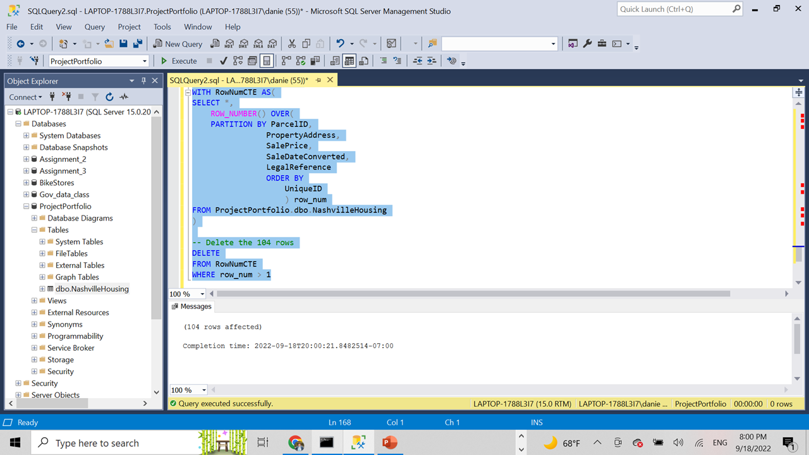
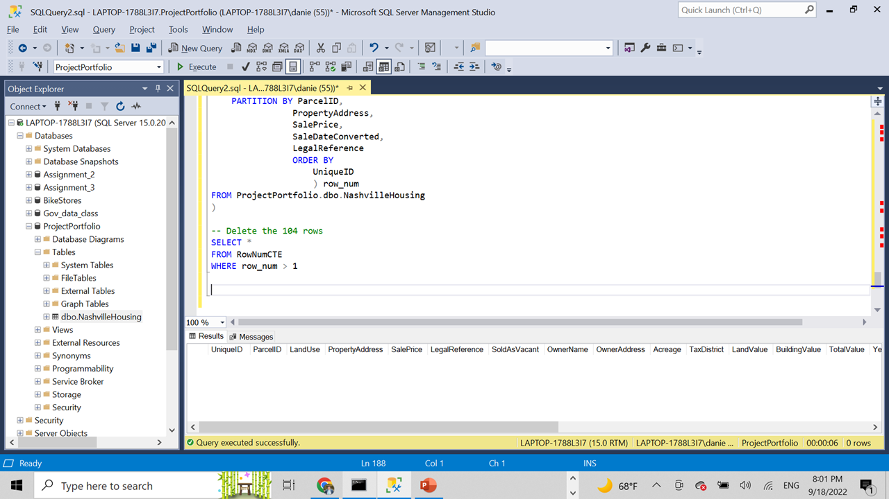

<h1 style="text-align:center">Nashville Housing Data Cleaning <h1>

<h3 style="text-align:right"> By: Jorge Daniel Atuesta <h3>

## Aim 

This project was created to showcase my skills using SQL to clean raw data. This project is an original from "Alex the Analyst". 

## Repo Structure
1. **Images** folder: contains all images used for this markdown file.
2. **Resources** folder: Contains the original excel file

## Results

### The project had 8 main phases:
1. Import the excel file into SQL Server database.
2. Using CONVERT function I standardized the date format.
3. Populated property addresses using another coloumn as reference.
4. Decided to make the data wide so for the column PropertyAddress split to address city and state. I used the SUBSTRING method and CHARINDEX.
5. Decided to make the data wide so for the column OwnerAddress split to address city and state. I used the PARSENAME REPLACE methods. 
6. On the column SoldAsVacant I decided to convert all values to the same type. So transformed Y to Yes and N to No. 
7. Removed duplicates from the table. DISCLAIMER - It's best practice to remove data from views and not original datasets. 
8. I deleted columns that I did not need. DISCLAIMER - It's best practice to remove data from views and not original datasets.

## Visualizing the code
In the following section you can see the before and after the code when executed. 

### Phase 2: Standarize Sale Date Format

### Phase 3: Populate Property Address using another column as reference
#### **Before**

#### **After**
### Phase 4: Split Property Address column (Address, City, State)
#### **Before**

#### **After**
### Phase 5: Split Owner Address column (Address, City, State)
#### **Before**

#### **After**
### Phase 6: Alter SoldAsVacant
#### **Before**

#### **After**

### Phase 7: Removed duplicates
#### **Before**

#### **After**

